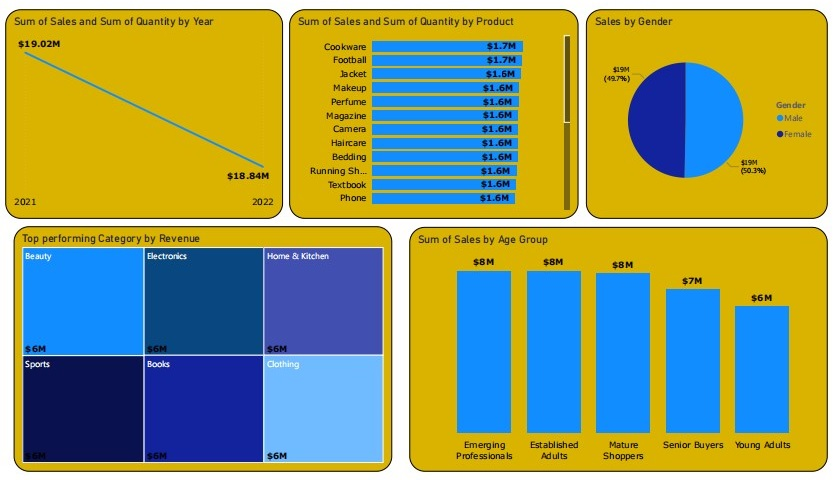

# Retail-Store-Sales-Analysis

# 📊 Project Overview

This project analyzes 50,000 retail transactions to uncover insights on sales performance, customer demographics, and product category trends.
The analysis was conducted in Power BI, applying data cleaning, transformation, modeling, and visualization to deliver actionable insights.

# 🛠️ Tools Justification

Although the task suggested using Python libraries (Matplotlib, Seaborn, etc.), this analysis was completed in Power BI. The choice was based on two reasons:

- Skill Level: At the time of the project, Python visualization techniques had not yet been covered in my learning path, while I had stronger practical knowledge of Excel and Power BI.

- Business Relevance: Power BI is widely adopted in organizations for interactive dashboards, KPI tracking, and storytelling with data, making it a practical tool for communicating insights to non-technical stakeholders.

This ensured the project still met its objectives of transforming raw data into clear insights and actionable recommendations, even though a different tool was used.

# 🛠️ Process & Tools Used
### 1. Data Cleaning & Transformation (Power Query)

- Removed duplicates and handled missing values.

- Formatted date fields and created a calendar table for time-based analysis.

- Grouped Age and Customer Spending into meaningful segments.

### 2. Data Modeling

- Built relationships between Sales Table and Date Table (1-to-many).

- Star schema model for efficient reporting.

- Ensured proper data types (numeric, text, date).

### 3. DAX Measures

Created calculated measures, including:

Total Sales = SUM(Sales[AmountSpent])

Total Customers = DISTINCTCOUNT(Sales[CustomerID])

Average Spending = DIVIDE([Total Sales],[Total Customers])

Running Total = CALCULATE([Total Sales], FILTER(ALL(DateTable), DateTable[Date] <= MAX(DateTable[Date])))

### 4. Visualization (Power BI Dashboards)

- KPI Cards for Total Sales, Customers, and Avg Spending.

- Line Charts for sales trends over time.

- Bar & Pie Charts for demographics and spending segmentation.

- Treemaps for top-performing categories and products.

# 🔑 Key Findings

- Sales: 2021 ($19.02M) vs 2022 ($18.84M) → slight 1% decline.

- Customers: 50K total.

- Top Product: Cookware ($1.7M).

- Customer Segmentation: Mid-age professionals (25–44+) drive ~70% of revenue.

- High Spenders: 10% of customers contribute 26% of sales.

# ✅ Recommendations

- 🎯 Launch a VIP loyalty program to retain high spenders.

- 👥 Target Emerging Professionals & Established Adults in campaigns.

- 📈 Boost seasonal campaigns to counteract sales dips.

- 🛒 Promote bundling & cross-selling across product categories.

# 📌 Conclusion

The retail store shows a strong and stable performance with a diverse product portfolio and a balanced customer base across gender and categories. Growth opportunities lie in leveraging mid-age professionals and high spenders, along with reinvigorating sales growth through strategic promotions and loyalty programs.
